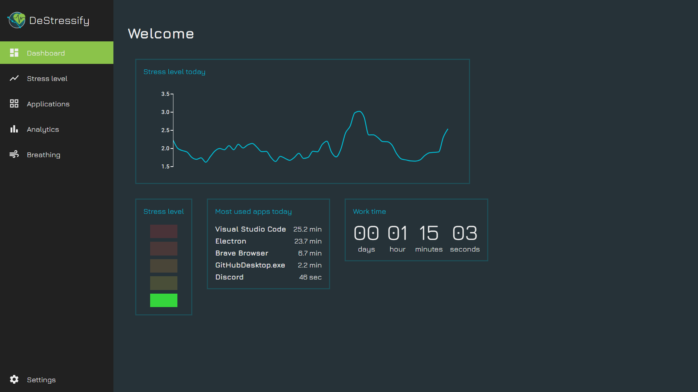
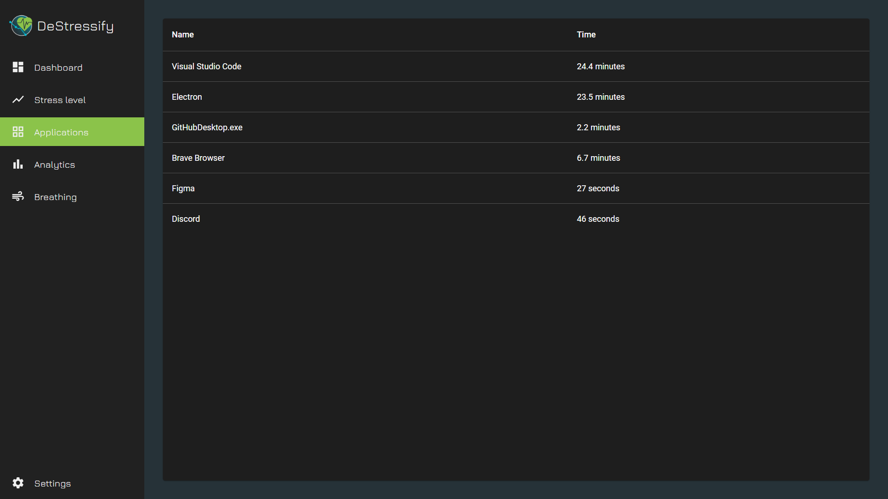
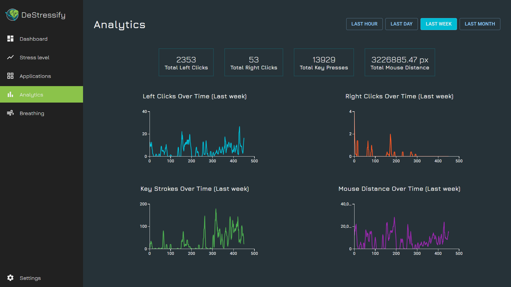
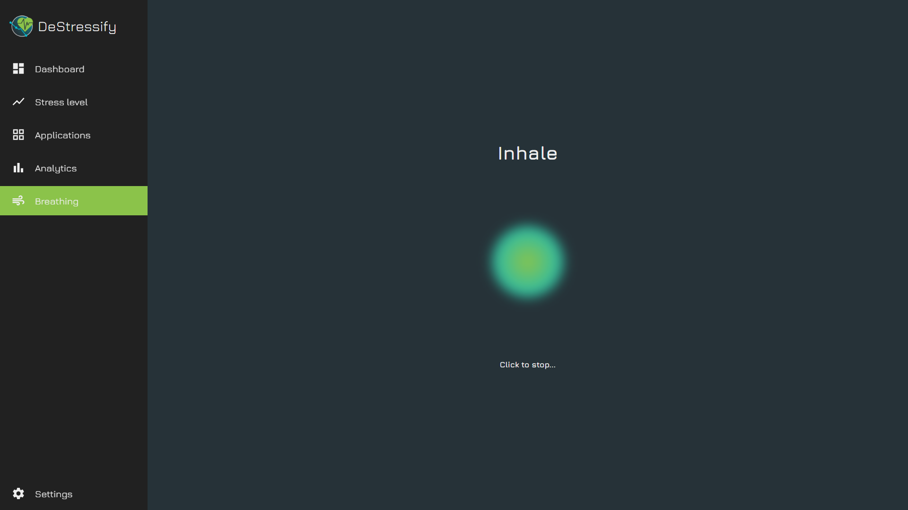

# DeStressify

Desktop application for monitoring stress during work hours, providing insights into personal stress patterns, offering
aggregated dashboard of team-wide wellbeing trends as a crucial initiative for workplace efficiency.

## Authors

- [@n2one](https://github.com/n2oneProgrammer)
- [@mwawrzen](https://github.com/mwawrzen)
- [@anuszek](https://github.com/anuszek)
- [@jaanonim](https://github.com/jaanonim)


## Run Locally

Clone the project

```bash
  git clone https://github.com/Rock-Hyrax/client.git
```

Go to the project directory

```bash
  cd client
```

Install dependencies

```bash
  npm install
```

Start the server

```bash
  npm run dev
```

## Screenshots







